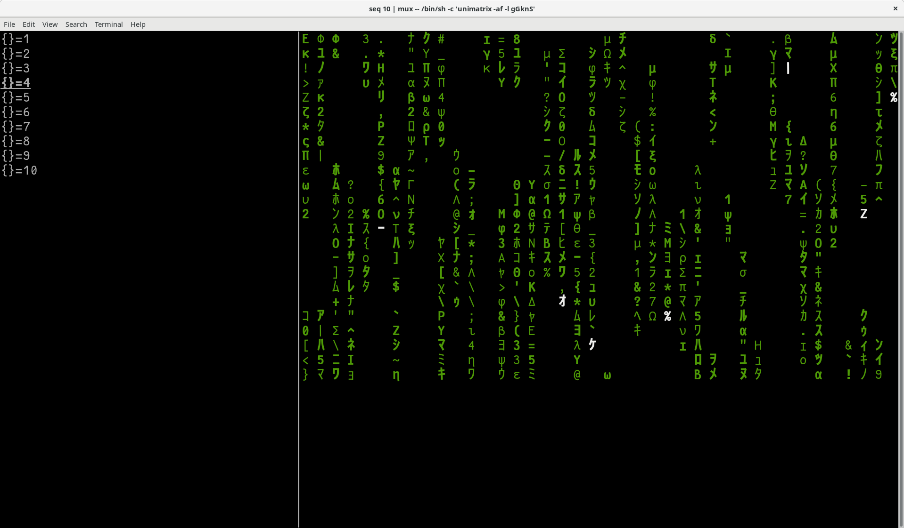

# `mux`

> Like `tmux` but without the `t`

`mux` is a terminal command multiplexer.  It tries to be compatible with `xargs`; it accepts the same flags and syntax.

The big difference is that `mux` runs all commands in parallel, in separate pseudo-terminals.  As such, it can be used to
replace tools such as `cluster-ssh` and `tmux` for the use-case where you want to run lots of commands in parallel and give
them the same input.

`mux` was written for my personal use in my free time, and as such there is not a super huge focus on code quality or testing.
The tool is pragmatic and tries to cover common use-cases.



## Installation

[Install Rust](https://rustup.rs/), then:

```
$ rustup toolchain add nightly-2019-02-24
$ cargo +nightly-2019-02-24 install --git https://github.com/dflemstr/mux.git
```

Make sure that `~/.cargo/bin` is in your `PATH` (`rustup` usually sets this up automatically).

## Simple usage

Running `echo '1 2 3' | tmux command arg1 arg2` will start `command arg1 arg2 1`, `command arg1 arg2 2` and `command arg1 arg2 3`
in parallel.

You use `Ctrl+T` to exit the GUI that pops up.

See `mux --help` for more info.

## Examples

```
$ cat hosts.txt
m1.example.com
m2.example.com
m3.example.com
m4.example.com
# Starts the 'uptime' command using 'ssh' on all hosts in parallel.
$ mux ssh '{}' uptime < hosts.txt
```
